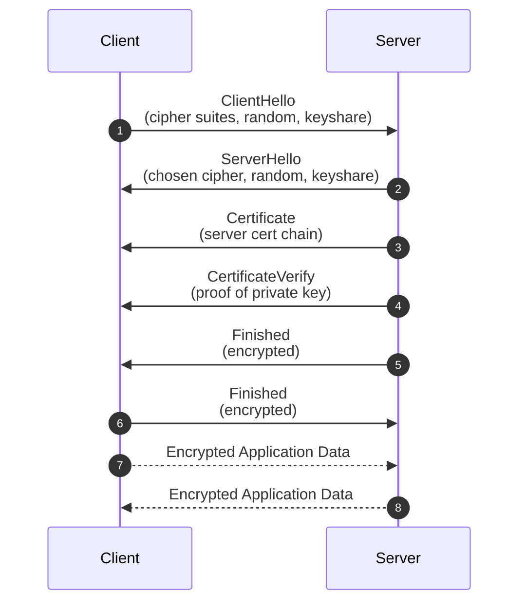
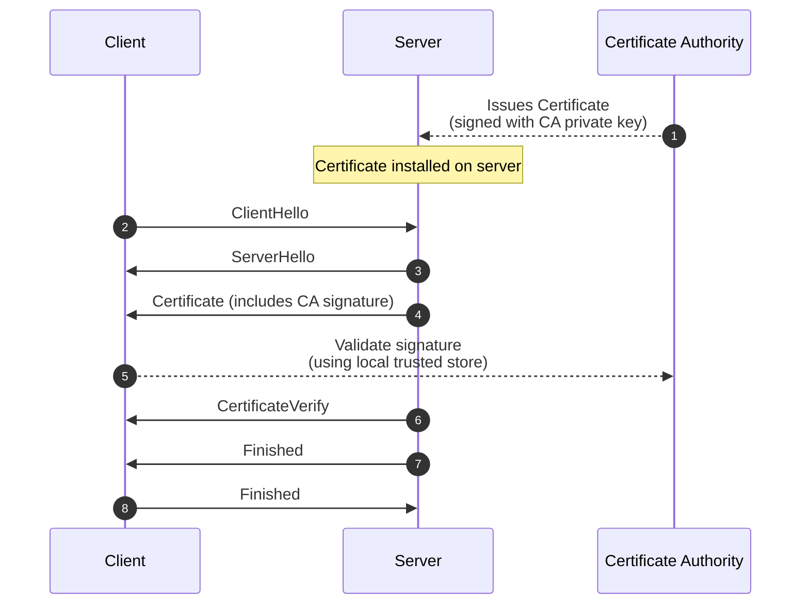

# TLS

## Component

- Certificate Authority (CA): Trust anchor to verify a certificate actually controls the domain or organization name.
- Server private key: Decrypt handshake message & Sign messages to prove ownership
- Server public key: Included inside the certificate. Used by clients to verify signatures created by the private key & Encrypt handshake materials
- Server certificate: A digitally signed file containing the public key, the server's domain name, validity information and the CA's signature.

## Flow

We kick off a TLS handshake, in which the client and the server:

1. Specify the version of TLS to use
2. Decide the cipher suite (set of encryption algorithms)
3. Authenticate the server's identity via the server's private key + certificate authority (trusted 3rd party)'s digital signature
4. Generate session keys for symmetric encryption (single shared secret key to both encrypt and decrypt) after the handshake?

## Mutual TLS connection/Two-way connection

- Issue certificates: The CA signs the server's certificate using its private key.
- Form a trust chain: Clients ships with a store of trusted CA public keys so it can verify CA signature on server certifificate.
- Enable server authentication: The CA works as a trust anchor between the client and the server. Without CA, the client cannot trust a certificate, even if the server sends a valid public key.

